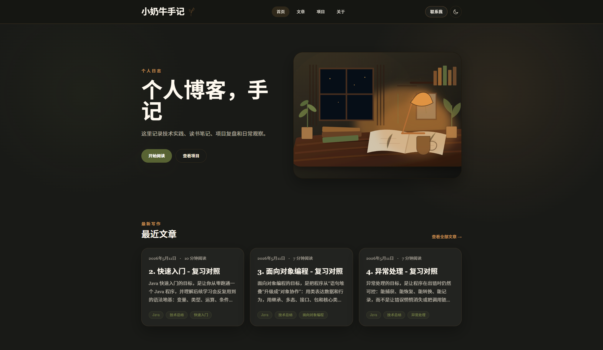

# 小奶牛手记

一个使用 `Vue 3`、`Vite` 和 `TypeScript` 搭建的个人博客项目，用来整理技术笔记、人文思考、项目记录和日常观察。



## 功能

- 首页、文章、项目、关于等完整页面
- 基于 Markdown 的文章管理
- 文章标签、摘要、阅读时长和详情页
- 深色 / 浅色主题切换
- 响应式布局，适配桌面与移动端

## 技术栈

- Vue 3
- Vue Router
- TypeScript
- Vite
- Tailwind CSS
- Markdown-it

## 本地运行

```bash
npm install
npm run dev
```

启动后访问：

```text
http://127.0.0.1:5173
```

## 常用命令

```bash
npm run dev       # 启动开发环境
npm run build     # 构建生产版本
npm run lint      # 运行代码检查
npm run typecheck # 运行类型检查
```

## 目录结构

```text
content/posts/   Markdown 文章
src/components/  页面组件
src/pages/       路由页面
src/lib/         文章解析、SEO、日期工具
src/data/        项目数据
```

## 内容说明

- 文章统一放在 `content/posts/`
- 每篇文章使用 frontmatter 维护标题、日期、摘要和标签
- 项目卡片数据维护在 `src/data/projects.ts`
